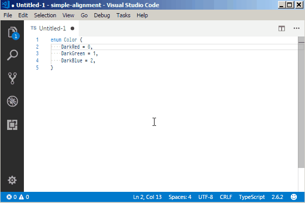

# Simple Alignment

This extension allows you to align multiple selections into columns.  It is strongly inspired by the [Alignment][SublimeAlignment] extension for Sublime Text.

Unlike other extensions for VS Code like [Alignment][] and [Better Align][], this one does not decide for you what and how to align, and lets you have everything under control.

The functionality is available via the Command Palette (Ctrl+Shift+P > "Align") or a keybinding `Ctrl+Alt+A`.  You can always change the keybinding via Ctrl+Shift+P > "Preferences: Open Keyboard Shortcuts".

[SublimeAlignment]: https://packagecontrol.io/packages/Alignment

[Alignment]: https://marketplace.visualstudio.com/items?itemName=annsk.alignment
[Better Align]: https://marketplace.visualstudio.com/items?itemName=wwm.better-align
